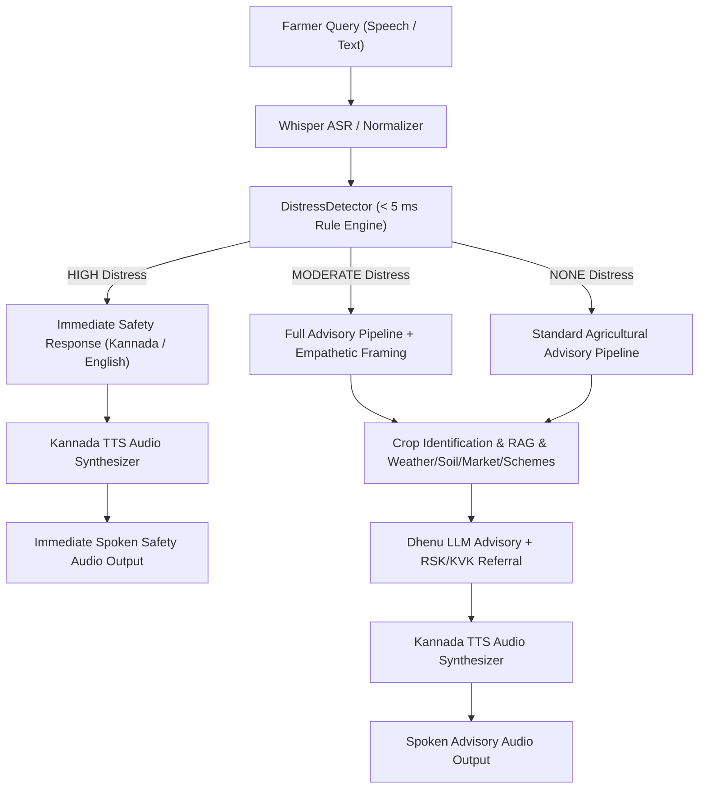

# RaithaMitra — Farmer Distress Detection & Conversational Safety Escalation Layer

**Major Project BAD685 — Department of Artificial Intelligence & Data Science, KSSEM Bengaluru**  
**Module:** `model/distress/` | **Version:** 1.0.0 | **Execution SLA:** < 5 ms

---

## 1. System Overview & Core Safety Principles

RaithaMitra incorporates a lightweight, deterministic, explainable conversational safety triage system designed to identify farmer distress arising from severe crop loss, unmanageable debt, extreme financial pressure, or statements indicating personal danger/self-harm.

### Core Non-Negotiable Principles:
1. **Non-Medical Principle**: RaithaMitra does NOT provide psychiatric diagnoses, medical assessments, clinical risk scoring, or suicide prediction. Distress detection is strictly a conversational safety signal and fast-path triage mechanism.
2. **No Claiming Psychiatric Conditions**: The system never states or implies "You have depression", "You are suicidal", or "You have a mental illness".
3. **No Invented Helplines**: No unverified phone numbers or emergency helplines are fabricated. For high-risk safety, the system guides the farmer to stay with trusted family/friends, visit the nearest medical clinic/hospital, or contact local emergency services. For agricultural distress, official local support institutions (Raitha Samparka Kendra, KVK) are recommended.
4. **Deterministic High-Risk Fast Path**: Statements indicating immediate personal danger bypass deep LLM generation, RAG document retrieval, weather, soil, and market lookups to return an immediate, calm Kannada safety response and generate spoken TTS audio without delay (< 5 ms text processing).
5. **False-Positive Protection**: Ordinary crop failure, plant drying, or plant death phrases (e.g. `"ನನ್ನ ಬೆಳೆ ಸತ್ತುಹೋಗುತ್ತಿದೆ"`, `"ಗಿಡಗಳು ಸತ್ತುಹೋಗಿವೆ"`) are explicitly protected and evaluate to `NONE` distress.

---

## 2. System Architecture & Priority Routing



---

## 3. Three-Tier Classification Taxonomy

| Severity Level | Definition | Priority Tag | Pipeline Execution Behavior |
| :--- | :--- | :--- | :--- |
| **`NONE`** | Normal agricultural query or ordinary farmer frustration regarding weather, pests, or market prices. | `normal` | Full agricultural advisory pipeline (ASR -> Crop ID -> RAG -> Weather/Soil/Market/Schemes -> Dhenu LLM -> NLLB -> TTS). |
| **`MODERATE`** | Meaningful financial crisis, heavy debt burden, multi-year crop loss, or severe emotional strain without explicit self-harm intent. | `advisory` | Full agricultural advisory pipeline + Empathetic prefix framing + Official Raitha Samparka Kendra (RSK) / Krishi Vigyan Kendra (KVK) referral. |
| **`HIGH`** | Explicit language indicating immediate personal danger, self-harm intent, or inability to continue living. | `safety` | **HIGH-RISK FAST PATH**: Immediately bypasses RAG, Dhenu LLM, NLLB, and context lookups. Returns deterministic safety response in < 5 ms and generates spoken safety audio via TTS. |

---

## 4. Curated Signal Taxonomy & Language Support

### A. Plant Object Protection Set (Prevents False Positives)
* **Kannada Terms**: `ಬೆಳೆ`, `ಗಿಡ`, `ಮರ`, `ಸಸಿ`, `ಎಲೆ`, `ಹೂ`, `ಕಾಯಿ`, `ಕಾಳು`, `ತೋಟ`, `ಗದ್ದೆ`, `ಹೊಲ`, `ರಾಗಿ`, `ಭತ್ತ`, `ಮೆಕ್ಕೆಜೋಳ`, `ಟೊಮ್ಯಾಟೊ`, `ಈರುಳ್ಳಿ`, `ಬಾಳೆ`, `ಕಲ್ಲಂಗಡಿ`, `ಅಡಿಕೆ`, `ಕಬ್ಬು`
* **English Terms**: `crop`, `plant`, `tree`, `leaf`, `leaves`, `field`, `paddy`, `ragi`, `maize`, `tomato`, `onion`, `arecanut`, `sugarcane`
* **Plant Damage Verbs**: `ಸತ್ತುಹೋಗುತ್ತಿದೆ`, `ಸತ್ತುಹೋಗಿದೆ`, `ಸಾಯುತ್ತಿದೆ`, `ಒಣಗುತ್ತಿದೆ`, `ಕೊಳೆಯುತ್ತಿದೆ`, `ಹಾಳಾಗಿದೆ`, `dying`, `dead`, `rotting`, `damaged`

### B. High-Risk Personal Danger Signals (`HIGH`)
* **Kannada**: `"ಜೀವನ ಮುಗಿಸಿಕೊಳ್ಳಬೇಕು"`, `"ಬದುಕಲು ಇಷ್ಟವಿಲ್ಲ"`, `"ನನ್ನ ಜೀವನ ಮುಗಿದಂತಾಗಿದೆ ಬದುಕುವುದಿಲ್ಲ"`, `"ನಾನು ಸಾಯಬೇಕು ಅನ್ನಿಸುತ್ತಿದೆ"`, `"ಆತ್ಮಹತ್ಯೆ ಮಾಡಿಕೊಳ್ಳಬೇಕು"`
* **English / Mixed**: `"want to end my life"`, `"going to end my life"`, `"want to die"`, `"cannot live anymore"`, `"do not want to live anymore"`

### C. Moderate Distress & Financial Debt Signals (`MODERATE`)
* **Kannada Debt & Financial**: `"ಸಾಲ ತೀರಿಸಲು ಆಗುತ್ತಿಲ್ಲ"`, `"ಸಾಲ ತೀರಿಸಲು ಆಗುವುದಿಲ್ಲ"`, `"ಸಾಲದ ಒತ್ತಡ ತುಂಬಾ ಇದೆ"`, `"ಸಾಲ ಹೇಗೆ ತೀರಿಸಲಿ"`, `"ಬ್ಯಾಂಕ್ ಸಾಲ ಕಟ್ಟಲು ಆಗುತ್ತಿಲ್ಲ"`, `"ಎರಡು ವರ್ಷಗಳಿಂದ ಬೆಳೆ ನಷ್ಟ"`
* **English Debt & Loss**: `"cannot repay loan"`, `"loan pressure"`, `"heavy debt burden"`, `"how to repay loan"`, `"crop loss for two years"`, `"suffered crop loss"`, `"extremely difficult"`
* **Mixed Codeswitching**: `"Crop full loss ಆಗಿದೆ, loan ಹೇಗೆ pay ಮಾಡಲಿ?"`, `"ನನಗೆ ತುಂಬಾ stress ಆಗಿದೆ"`, `"Loan pressure ತುಂಬಾ ಇದೆ"`

---

## 5. Critical False-Positive & Context Protection Matrix

| Query Input | Expected Level | Actual Level | Pipeline Path | Result |
| :--- | :--- | :--- | :--- | :--- |
| `"ನನ್ನ ರಾಗಿ ಬೆಳೆಗೆ ಮಳೆ ಸರಿಯಾಗಿ ಆಗಿಲ್ಲ."` | `NONE` | `NONE` | Standard Advisory | Grounded RAG advice for dry spell |
| `"ನನ್ನ ಬೆಳೆ ಸತ್ತುಹೋಗುತ್ತಿದೆ, ಏನು ಮಾಡಬೇಕು?"` | `NONE` | `NONE` | Standard Advisory | Grounded crop disease/irrigation advice |
| `"ಗಿಡಗಳು ಸತ್ತುಹೋಗಿವೆ"` | `NONE` | `NONE` | Standard Advisory | Grounded plant management advice |
| `"ಹುಳು ಸಾಯಬೇಕು"` | `NONE` | `NONE` | Standard Advisory | Grounded pest control guidance |
| `"ನನ್ನ ಬೆಳೆ ಸಂಪೂರ್ಣ ಹಾಳಾಗಿದೆ. ಸಾಲ ಹೇಗೆ ತೀರಿಸಲಿ?"` | `MODERATE` | `MODERATE` | Advisory + Empathy | Agricultural guidance + RSK/KVK referral |
| `"ಎರಡು ವರ್ಷಗಳಿಂದ ಬೆಳೆ ನಷ್ಟವಾಗುತ್ತಿದೆ. ತುಂಬಾ ಕಷ್ಟವಾಗುತ್ತಿದೆ."` | `MODERATE` | `MODERATE` | Advisory + Empathy | Agricultural guidance + RSK/KVK referral |
| `"Crop full loss ಆಗಿದೆ, loan ಹೇಗೆ pay ಮಾಡಲಿ?"` | `MODERATE` | `MODERATE` | Advisory + Empathy | Grounded advice + Empathetic framing |
| `"ನನ್ನ ಜೀವನ ಮುಗಿಸಿಕೊಳ್ಳಬೇಕು"` | `HIGH` | `HIGH` | Fast Path | Immediate spoken Kannada safety response |
| `"I want to end my life"` | `HIGH` | `HIGH` | Fast Path | Immediate spoken English safety response |

---

## 6. API Response Payload Schema

Both `POST /api/v1/advisory` and `POST /api/v1/advisory/audio` return the structured `distress` metadata object in every response payload:

```json
{
  "success": true,
  "language": "kn",
  "canonical_crop": "ragi",
  "answer": "ನಿಮ್ಮ ಪರಿಸ್ಥಿತಿ ಮತ್ತು ಕಷ್ಟ ನಮಗೆ ಅರ್ಥವಾಗುತ್ತದೆ. ಧೈರ್ಯವಾಗಿರಿ. ರಾಗಿ ಬೆಳೆಗೆ ನೀರಿನ ಕೊರತೆಯಾದಾಗ... ಇದರ ಜೊತೆಗೆ ಸ್ಥಳೀಯ ರೈತ ಸಂಪರ್ಕ ಕೇಂದ್ರ (RSK) ಅಥವಾ ಕೃಷಿ ವಿಜ್ಞಾನ ಕೇಂದ್ರವನ್ನು (KVK) ಸಂಪರ್ಕಿಸಿ.",
  "distress": {
    "detected": true,
    "level": "MODERATE",
    "priority": "advisory"
  },
  "location": { "district": "Mandya" },
  "metadata": {
    "processing_time_seconds": 0.012
  }
}
```

For `HIGH` severity queries:
```json
{
  "success": true,
  "language": "kn",
  "canonical_crop": null,
  "answer": "ನೀವು ಈಗ ತುಂಬಾ ಕಷ್ಟದಲ್ಲಿರುವಂತೆ ಕಾಣುತ್ತಿದೆ. ದಯವಿಟ್ಟು ಒಬ್ಬರೇ ಇರಬೇಡಿ. ನಿಮ್ಮ ಕುಟುಂಬದವರು ಅಥವಾ ವಿಶ್ವಾಸದ ವ್ಯಕ್ತಿಯೊಬ್ಬರನ್ನು ಈಗಲೇ ಸಂಪರ್ಕಿಸಿ ಮತ್ತು ಹತ್ತಿರದ ಆಸ್ಪತ್ರೆ ಅಥವಾ ಸ್ಥಳೀಯ ತುರ್ತು ಸೇವೆಯಿಂದ ತಕ್ಷಣ ಸಹಾಯ ಪಡೆಯಿರಿ.",
  "distress": {
    "detected": true,
    "level": "HIGH",
    "priority": "safety"
  },
  "metadata": {
    "processing_time_seconds": 0.001
  }
}
```

---

## 7. Privacy & Logging Policy

1. **No Transcript Persistence**: Raw distress transcripts are NOT permanently stored or logged to disk in standard application logs.
2. **Log Sanitization**: Internal logs log only the high-level `DistressLevel` enum and processing latency, stripping sensitive personal identity or raw query text.
3. **No User Profiling**: No persistent database profile or tracking record is created for distress interactions.

---

## 8. Performance & Benchmarking SLAs

* **Deterministic Detection Target**: `< 5 ms`
* **Benchmark Result (10,000 runs)**: **`0.0196 ms`** (`19.65 microseconds` average latency per call, **~250x faster** than target budget).
* **HIGH Fast Path Latency**: `< 1 ms` text generation + TTS synthesis latency.
